# TP1: memory segmentation and linked lists

ENSEA 3rd year (IS), Systèmes et Réseaux.

## Build

```bash
make
```

Each `src/*.c` builds into `bin/<name>`. Run the programs from this folder: exercise 2 reverses `data/test.txt` in place, so a second run restores it.

| Exercise | Source | Run |
|---|---|---|
| 1. Memory segments, checked with `pmap -X` | `src/ex1_memory_segments.c` | `./bin/ex1_memory_segments` |
| 2. File mapping with `mmap` | `src/ex2_file_mapping.c` | `./bin/ex2_file_mapping` |
| 3. Linked lists, one file per question | `src/ex3_q01_create.c` to `src/ex3_q11_circular.c` | `./bin/ex3_q01_create` to `./bin/ex3_q11_circular` |

## Screenshots

Exercise 1

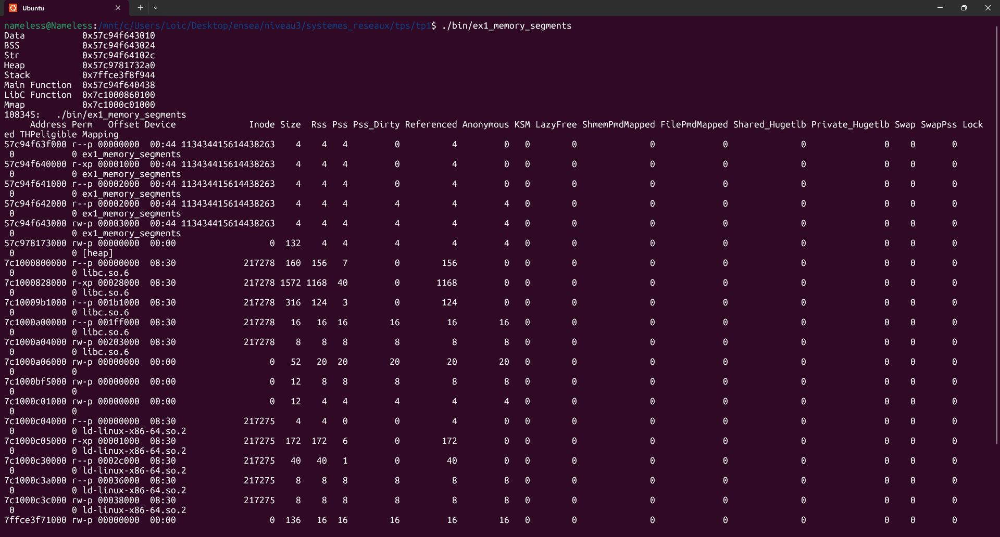

Exercise 2

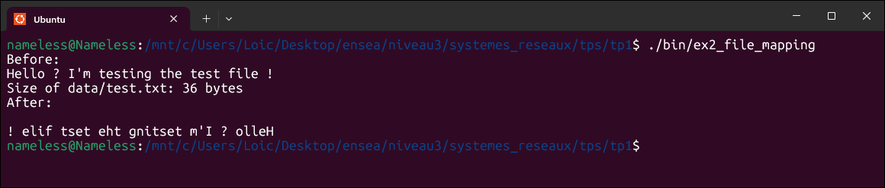

Exercise 3

| Question | Screenshot |
|---|---|
| 1. Create the list | 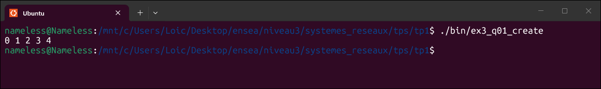 |
| 2. Length | 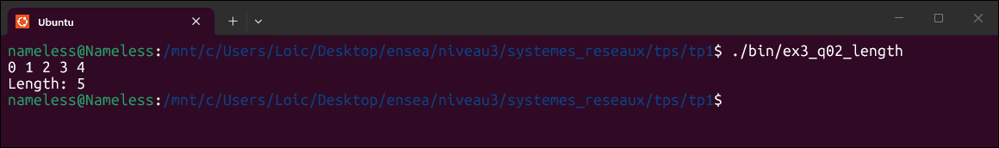 |
| 3. Print | 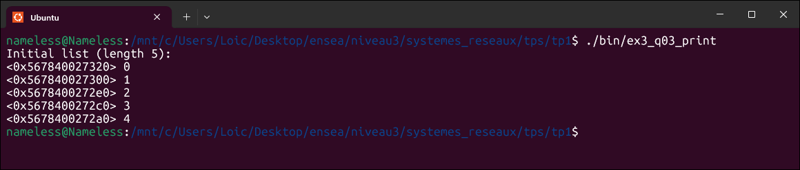 |
| 4. Remove the first element | 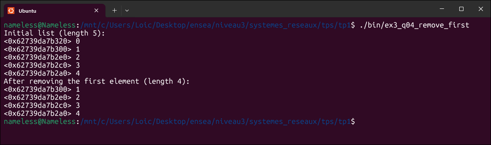 |
| 5. Remove the last element | 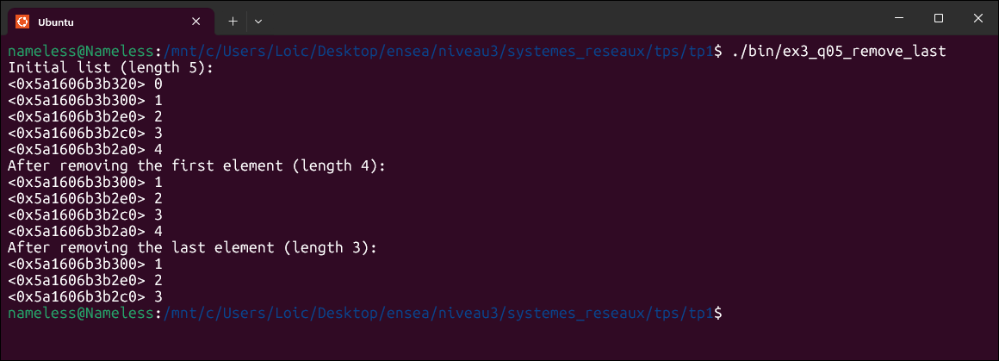 |
| 6. Append | 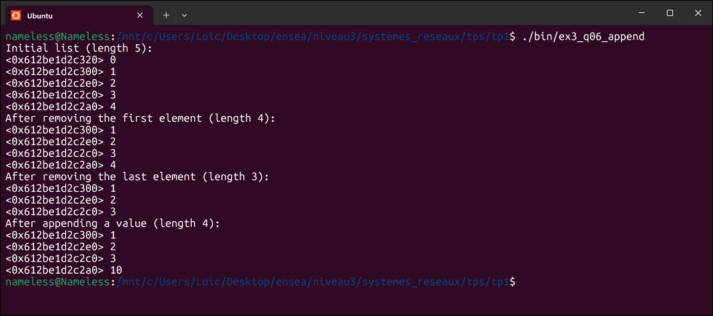 |
| 7. Prepend | 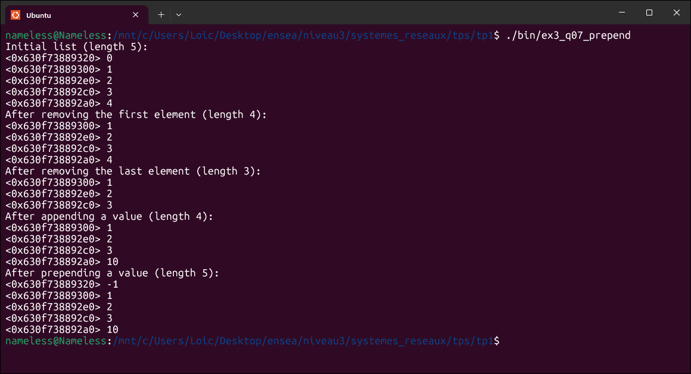 |
| 8. Concatenate | 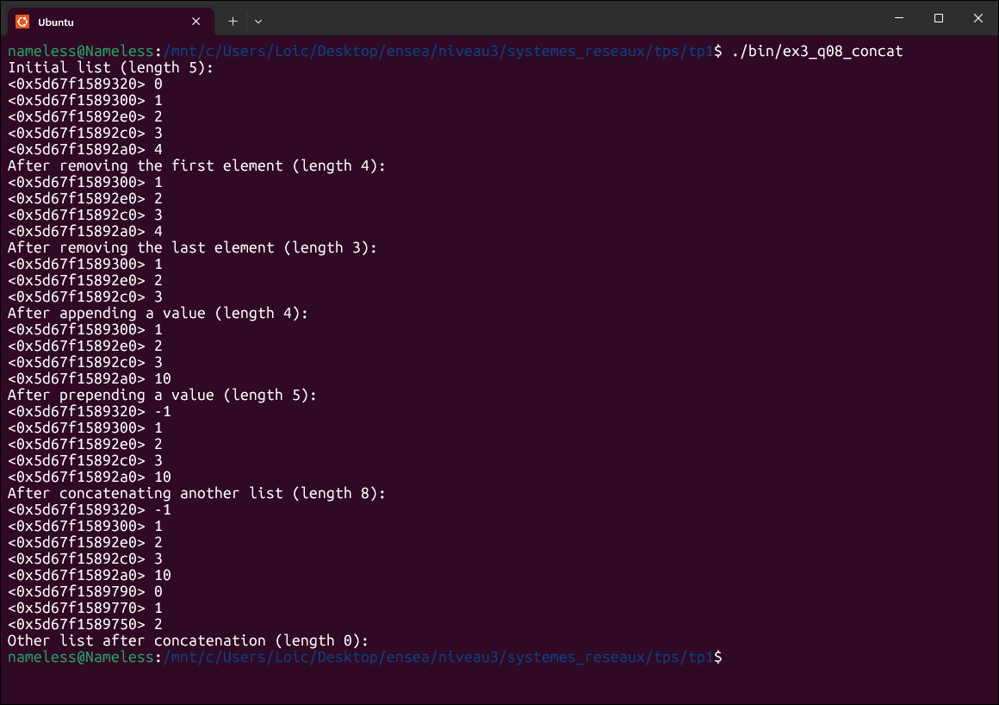 |
| 9. Map | 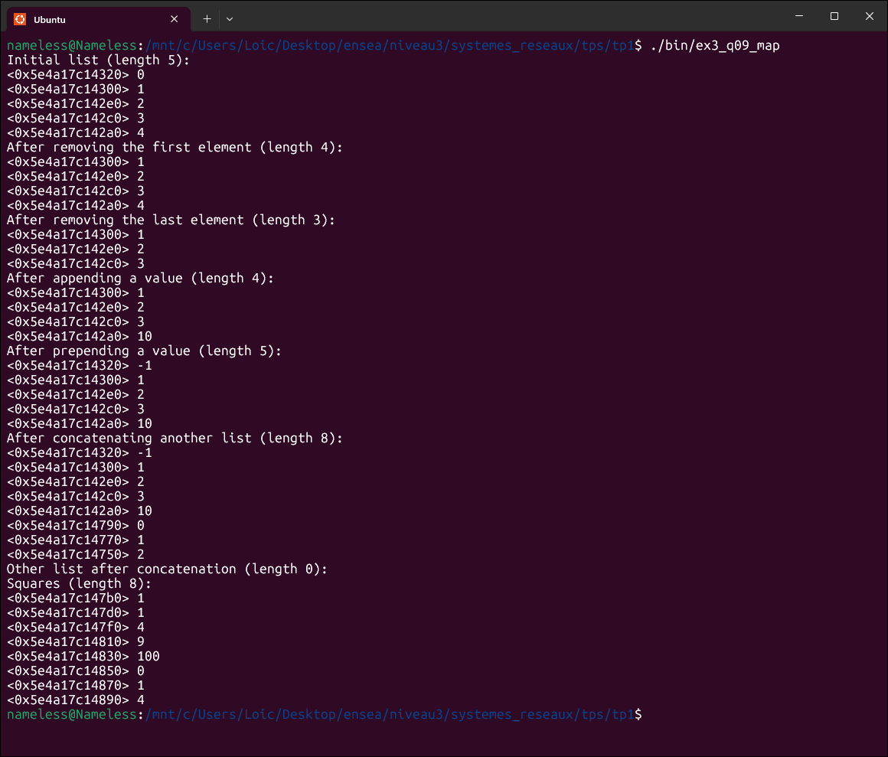 |
| 10. Doubly linked list | 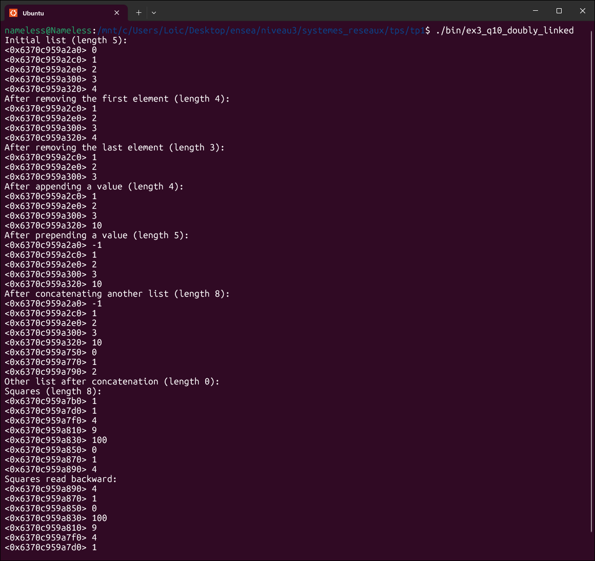 |
| 11. Circular doubly linked list | 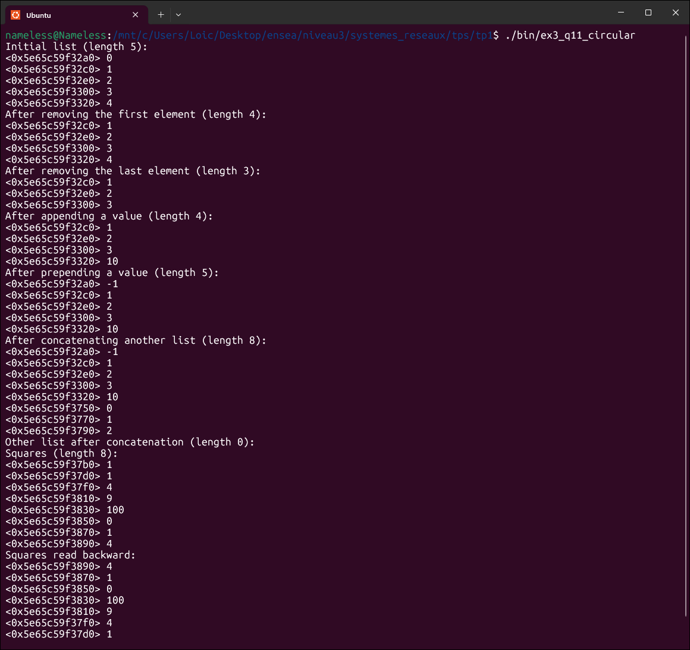 |
